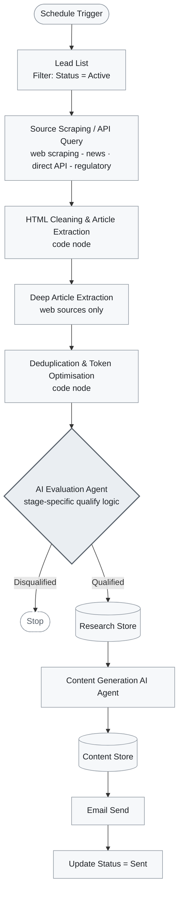

# Automated Lead Research & Outreach System (n8n)

 🧭 **Portfolio project by Elijah Peh** — Solutions Engineer / Forward-Deployed Engineer.
 Connect on [LinkedIn](https://www.linkedin.com/in/elijah-peh-3b5bb8ba/).

---

A **3-stage agentic AI pipeline** that automates the end-to-end process of identifying, qualifying, and approaching B2B sales leads - from monitoring industry and regulatory signals, to AI-based qualification, to generating and sending targeted outreach content

---

## Why it's interesting

Most "lead-gen automation" is a single scrape-and-blast script. This system instead models the client's **product development lifecycle** and runs a dedicated pipeline for each commercial stage, so the signals it looks for, the qualification criteria it applies, and the content it generates are all stage-appropriate.

It's a study in three things I care about as a solutions engineer:

- **Reliability in production** - error handling, deduplication, and status gating so nothing double-sends or silently fails.
- **Cost discipline** - token consumption is the main cost driver, so the architecture actively minimizes unnecessary LLM calls.
- **Designed to scale** - a documented roadmap from a built-in datastore to external DBs, semantic dedup, and CRM integration.

---

### Common pipeline

**Mid-stage variation:** runs multiple evaluation agents (one per source) and consolidates them through a unified qualification filter before content generation, with raw data stored per source.

---

## Qualification logic

**Shared across all workflows**

- **Lead filter** - only companies with `Status = "Active"` are processed.
- **Deduplication** - articles already in the research store are skipped before they reach an AI agent.
- **Qualification** - AI agents score each signal against stage-specific criteria.
- **Content gate** - only qualified leads get generated content.
- **Send gate** - only content rows with an empty status get emailed.

**Stage-specific signals** (generalized)

| Stage | Qualifies on | Disqualifies on |
|---|---|---|
| **Early** | New, relevant product launch matching target category | Out-of-scope product types, stale news |
| **Mid** | Regulatory submission activity with high packaging relevance and high lead tier | Out-of-scope devices, low-relevance signals |
| **Late** | Active trial with evidence, or confirmed launch with an explicit date | Announcements without a date, out-of-scope leads, stale news |

---

## Tech stack

- **Workflow automation:** n8n (self-hosted)
- **Web scraping:** managed scraping API (handles JS-rendered pages & anti-bot protection)
- **AI agents:** OpenAI GPT-4.1 - powers all evaluation and content-generation agents
- **Email delivery:** transactional email API
- **Data:** workflow-scoped tables (raw source data, evaluation results, generated content), separated by workflow and data type

> **Cost note:** token consumption is the primary cost driver. The deduplication step is what keeps it in check - filtering already-processed articles out *before* they reach an agent.

---

## Reliability: error handling

A dedicated error-handling workflow runs in parallel across all three stages and monitors the failure-prone nodes:

- scraping HTTP requests,
- AI evaluation agents,
- AI content-generation agents.

On failure, it sends an automated notification to the workflow owner - no manual log-watching required.

---

## Scaling roadmap

Designed for the initial scope, with a clear path forward as volume grows:

- **More sources / companies** → higher scraping and token costs; monitor usage, stagger or batch triggers, and keep deduplication effective as research tables grow. Large workflows may need splitting or higher execution limits.
- **Feedback loop** → add an outcome column (Converted / No Response / Bounced), optionally backed by a vector DB for semantic dedup and similarity search, and feed conversion data back into agent prompts to refine scoring over time.
- **Data out of the built-in store** → migrate to an external database (e.g. PostgreSQL / Supabase / Airtable) for richer querying, dashboards, and reporting - only read/write nodes change.
- **CRM integration** → push qualified leads straight into a CRM instead of emailing content.

---

## What I owned

Solution design, workflow implementation, AI agent prompt design and qualification logic, scraping/API integrations, cost optimization, and error handling - end to end.
